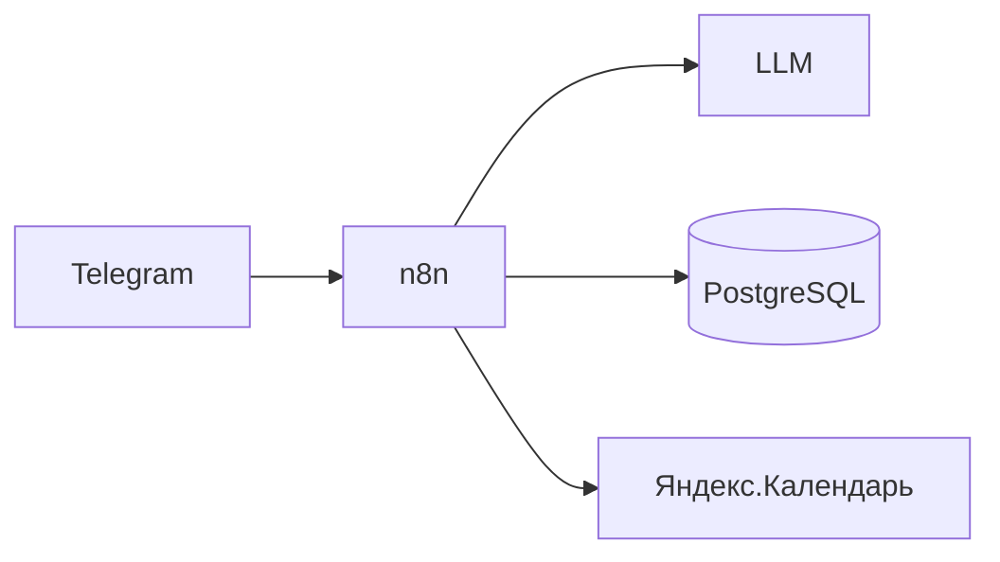

# personal_assistant

Личный ассистент: **docker, n8n, Telegram, PostgreSQL, LLM, CalDAV/Yandex Calendar**.

## Возможности

- Приём задач и просьб из Telegram, разбор через LLM, уточняющие вопросы.
- Календарь: события и задачи с датой/временем; фоновые дела без дат — в PostgreSQL (схема `assistant`).
- Напоминания при отсутствии активности по задаче 2–3 дня (логика в n8n: cron + запрос к `last_touch_at`).

## Быстрый старт

1. Скопировать окружение и задать секреты:

   ```bash
   cp .env.example .env
   # N8N_ENCRYPTION_KEY: openssl rand -hex 32
   ```

2. Запуск:

   ```bash
   docker compose up -d
   ```

3. Открыть n8n: `http://localhost:5678` (порт задаётся `N8N_PORT`).

4. В n8n настроить:
   - **Telegram Trigger** (или Webhook) + ответы боту;
   - **LLM** (OpenAI / OpenRouter / Ollama через HTTP);
   - **Postgres** — хост `postgres`, БД/пользователь из `.env`, схема `assistant`;
   - **Яндекс.Календарь** — [API календаря](https://yandex.ru/dev/calendar/doc/ru/) или CalDAV; токен OAuth в Credentials.

## Архитектура



- **n8n** — оркестрация, ветвления, таймеры напоминаний, вызовы API.
- **PostgreSQL** — данные n8n + таблицы `assistant.*` (фоновые дела, календарные записи, опционально история диалога).
- **Напоминания 2–3 дня**: scheduled workflow в n8n, `SELECT` по `assistant.background_items` и `assistant.calendar_items` где `last_touch_at < now() - interval '2 days'` (порог настроить под себя).

## Git

Репозиторий по аналогии с настройками из `ownCloud/pdns`:

- `origin`: `https://github.com/Ritm/personal_assistant.git`

## Лицензия

По желанию владельца репозитория.
